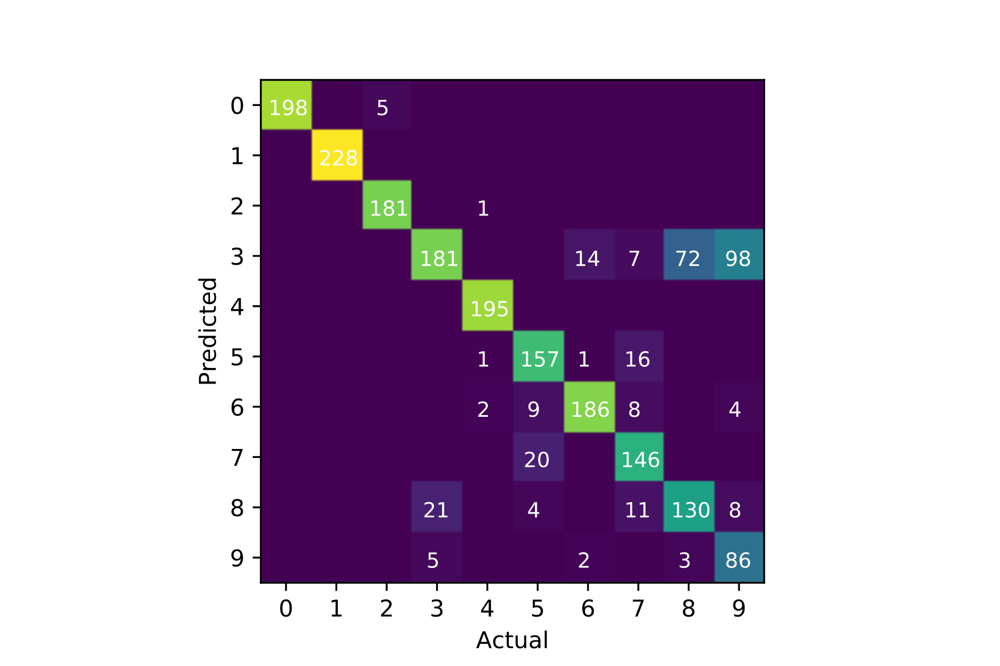

# cellClassifier
We have here a deep-learning model to classify cells based on single cell RNA (scRNA) sequencing data. More specifically, our model inputs a gene expression vector listing the counts of mRNA for each gene in a cell, and outputs one of 10 cell types it is predicted the cell belongs too.

---
## Minimal Example
```
import numpy as np
import utils
import h5py
from keras.models import load_model

# Get the data
f = h5py.File("data.mat")
data_0, labels_0 = np.array(f['data']), np.array(f['labels'])
f.close()

# Preprocess the data
colInds = np.load("assets/sorted_features.npy")[:1000]
data = utils.preprocess(data_0, colInds)
labels = utils.preprocess_labels(labels_0, NCLASS=10)

# Load the model
model = load_model("multi_perceptron.h5")

# Calculate 
preds = model.predict(data)
predicted_labels = np.argmax(preds, 1)
conf = utils.confusions(preds, labels)
fig = utils.plot_confusions(conf)
```


---
## Overview of Files
1. workflow.ipynb is the important file, showing fetching / processing the data, how to compile a keras model for training, the training and evaluation of the model, and various other parts of the workflow (This will be modularized / cleaned up later).

2. conv_net.h5 is a saved CNN keras model that performed well, getting about 80% testing accuracy, which is exciting given that this is a multi-class classification problem with 10 classes. 

3. multi_perceptron.h5 is a simpler, but more performant model that is just a simple feed-forward multi-layer perceptron. The important thing is that this model assumes the data has been preprocessed in a specific way (see feature subsampling section).

4. finding_relevant_genes.ipynb is a testing notebook where the point is to identify what features are necessary to get good performance by zeroing out certain features, retraining, and seeing the change in accuracy. This also includes chunks of code that do useful things like calculate the mutual information with class labels / Jensen shannon divergence for each gene, or find the correlation matrix for genes.

5. make_models.py is a module with functions for generating keras models with related / similar architectures. This module makes hyperparameter optimization via grid-search convenient, since all desired hyperparameters for optimization can be passed as arguments to the functions in this module.

6. utils.py is a module with some utilities I wrote ad-hoc in this workflow, the most important ones are the jensen_shannon and gene_divergence functions (more on those in the Feature subsampling section)/

7. low_level_tf_implementation is a work in progress, but will soon be the same architecture, implemented in tensorflow for an increase in sustainability / speed

8. assets is a folder with various images and data files for convenience. See Feature Subsampling for more.

---

# Feature subsampling via use of Jensen Shannon Divergence / Mutual Information with Class Labels

Jensen Shannon Divergence, or information radius, is an extension of KL divergence that is symmetric, and can also
be extended to more than 2 distributions. The idea here is that the genes / features most diagnostic in classifying cells will likely be the genes where the distributions of counts within each cell class (so 1 distribution per class) diverge the most. Thus, we compute the divergence for each gene, and sort the genes by this metric. This has already been done, and we have a precomputed list of gene indices, sorted by their jensen shannon divergence, in assets/divergences.csv. We thus only take the top 1000 genes to use for classification. This reduction of number of features allows us to go from CNNs to a simple multi-layer perceptron model, and the performance actually drastically improves!

What might be simpler intuitively is that the cross-class JS divergence is just the mutual information of gene counts with class labels for a given gene. Thus, the genes with the greatest JS divergence are the same genes that have the most mutual information with the class labels, hence motivating their importance.

## New Multi-layer perceptron summary
```
_________________________________________________________________
Layer (type)                 Output Shape              Param #   
=================================================================
dense_1 (Dense)              (None, 2048)              2050048   
_________________________________________________________________
dense_2 (Dense)              (None, 512)               1049088   
_________________________________________________________________
dropout_1 (Dropout)          (None, 512)               0         
_________________________________________________________________
dense_3 (Dense)              (None, 10)                5130      
=================================================================
Total params: 3,104,266
Trainable params: 3,104,266
Non-trainable params: 0
_________________________________________________________________
```
## Performance Metrics
Here we include an example of loading our model and evaluating a test set with it

### Loss / Accuracy
```python
from keras.models import load_model
model = load_model("multi_perceptron.h5")
loss, acc = model.evaluate(test_data, test_labels, )
print(f"Test loss: {loss}")
print(f"Test accuracy: {acc}")
```
Test loss: 0.6564117822647094

Test accuracy: 0.844

### Confusions
```
preds = model.predict(test_data)
conf = utils.confusions(preds, test_labels)
utils.plot_confusions(conf);
```


### Precision/Recall
|Class 	|precision 	|recall  |
|-------|-----------|--------|
|0 	    |0.980198 	|1.000000|
|1 	    |1.000000 	|0.995614|
|2 	    |0.989130 	|0.978495|
|3 	    |0.523333 	|0.758454|
|4 	    |1.000000 	|0.979900|
|5 	    |0.916667 	|0.810526|
|6 	    |0.898148 	|0.955665|
|7 	    |0.834197 	|0.856383|
|8 	    |0.718615 	|0.809756|
|9 	    |0.916667 	|0.392857|


## Original CNN Model summary
```
Layer (type)                 Output Shape              Param #   
=================================================================
conv2d_2 (Conv2D)            (None, 19232, 1, 16)      176       
_________________________________________________________________
max_pooling2d_1 (MaxPooling2 (None, 4808, 1, 16)       0         
_________________________________________________________________
conv2d_3 (Conv2D)            (None, 4808, 1, 32)       5152      
_________________________________________________________________
max_pooling2d_2 (MaxPooling2 (None, 1202, 1, 32)       0         
_________________________________________________________________
conv2d_4 (Conv2D)            (None, 1201, 1, 64)       4160      
_________________________________________________________________
max_pooling2d_3 (MaxPooling2 (None, 300, 1, 64)        0         
_________________________________________________________________
conv2d_5 (Conv2D)            (None, 300, 1, 128)       41088     
_________________________________________________________________
max_pooling2d_4 (MaxPooling2 (None, 100, 1, 128)       0         
_________________________________________________________________
flatten_1 (Flatten)          (None, 12800)             0         
_________________________________________________________________
dense_1 (Dense)              (None, 512)               6554112   
_________________________________________________________________
dropout_1 (Dropout)          (None, 512)               0         
_________________________________________________________________
dense_2 (Dense)              (None, 10)                5130      
=================================================================
Total params: 6,609,818
Trainable params: 6,609,818
Non-trainable params: 0
_________________________________________________________________
```

---
## Performance Metrics

```python
from keras.models import load_model
model = load_model("test_model.h5")
loss, acc = model.evaluate(test_data, test_labels)
print(f"Test loss: {loss}")
print(f"Test accuracy: {acc}")
```
    2000/2000 [==============================] - 0s 240us/step
    Test loss: 0.6971381943225861
    Test accuracy: 0.802

```
preds = model.predict(test_data)
conf = utils.confusions(preds, test_labels)
utils.plot_confusions(conf);
```


This was the original CNN model performance, but it is clear that the multilayer perceptron operating on a limited number of features performs better by far.

# TODO
1. document make_models.py better
2. Hyperparameter optimization for 2 hidden layer models
3. Make use of correlation / mutual info to eliminate redundant genes
